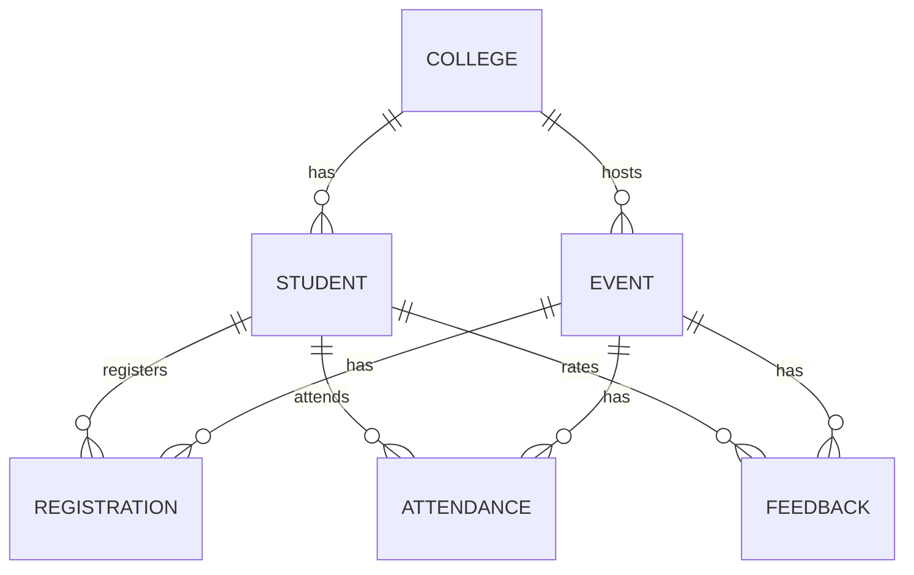
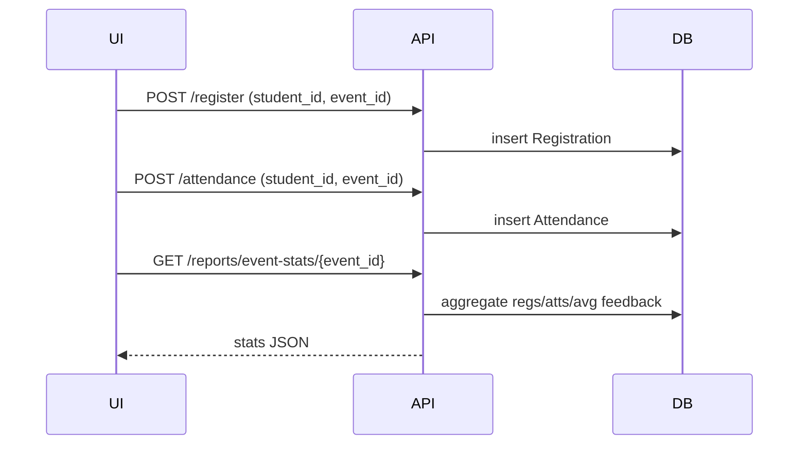

# Design Document — Campus Event Reporting Prototype

## Scope
Implements a minimal reporting system for a Campus Event Management Platform with:
- Admin (web) capabilities to create colleges, students, and events.
- Student flows to register, mark attendance, and submit feedback.
- Reports for event popularity, student participation, top active students, and per‑event stats.

## Data to Track
- Event creation (title, type, time window, college)
- Student registration (student ↔ event)
- Attendance (check‑in at event day)
- Feedback (rating 1–5, optional comment)

## Database Schema (SQLite)
**Entities**
- College(id, name)
- Student(id, name, email, college_id)
- Event(id, title, description, type, start_time, end_time, college_id)
- Registration(id, student_id, event_id, created_at) — **unique(student_id, event_id)**
- Attendance(id, student_id, event_id, check_in_time) — **unique(student_id, event_id)**
- Feedback(id, student_id, event_id, rating, comment, created_at) — **unique(student_id, event_id)**

### ER (Mermaid)


## API Design (FastAPI)
- `POST /colleges` — create college
- `GET /colleges` — list colleges
- `POST /students` — create student
- `GET /students?college_id=` — list students
- `POST /events` — create event
- `GET /events?college_id=&type=` — list events
- `POST /register` — register student to event
- `POST /attendance` — mark check‑in
- `POST /feedback` — submit rating/comment (1–5)
- Reports:
  - `GET /reports/event-popularity?college_id=&type=` — registrations per event (desc)
  - `GET /reports/student-participation/{student_id}` — reg/attended counts
  - `GET /reports/top-active?limit=3` — most attendance
  - `GET /reports/event-stats/{event_id}` — registrations, attendance %, avg rating

## Workflows (Mermaid)
### Registration → Attendance → Reporting


## Assumptions & Edge Cases
- Duplicate registration/attendance/feedback blocked via unique constraints.
- Feedback is limited to a single rating per student per event.
- Events are scoped to a college (IDs are globally unique but include a `college_id` field).
- For scale (~50 colleges × 500 students × 20 events/semester), SQLite suffices for the prototype. For production, use Postgres and add indexes.
- Missing feedback is treated as `null` for averages; attendance% is `0` if no registrations.
- Data separation: single dataset with `college_id` column in each table for simpler cross‑college reporting. A multi‑tenant approach (separate DB per college) is possible if isolation is required.

## SQL (illustrative)
```sql
-- Event popularity
SELECT e.id, e.title, COUNT(r.id) AS registrations
FROM events e
LEFT JOIN registrations r ON r.event_id = e.id
GROUP BY e.id
ORDER BY registrations DESC;

-- Student participation
SELECT
  (SELECT COUNT(*) FROM registrations WHERE student_id = :sid) AS registered,
  (SELECT COUNT(*) FROM attendance WHERE student_id = :sid) AS attended;

-- Top active students
SELECT s.id, s.name, COUNT(a.id) AS attended
FROM students s
JOIN attendance a ON a.student_id = s.id
GROUP BY s.id
ORDER BY attended DESC
LIMIT 3;

-- Event stats
SELECT
  (SELECT COUNT(*) FROM registrations WHERE event_id = :eid) AS regs,
  (SELECT COUNT(*) FROM attendance WHERE event_id = :eid) AS atts,
  (SELECT AVG(rating) FROM feedback WHERE event_id = :eid) AS avg_rating;
```

## Frontend
- Minimal HTML + Tailwind + JS (no build step) to call APIs and visualize responses.
- Filters for college and event type; simple forms to create entities and record actions.

## Future Enhancements
- Role‑based auth (Admin vs Student).
- QR-based check‑in codes per event.
- Pagination and server‑side filtering.
- Data validation and idempotency keys.
- Migrate to Postgres + Alembic migrations.
